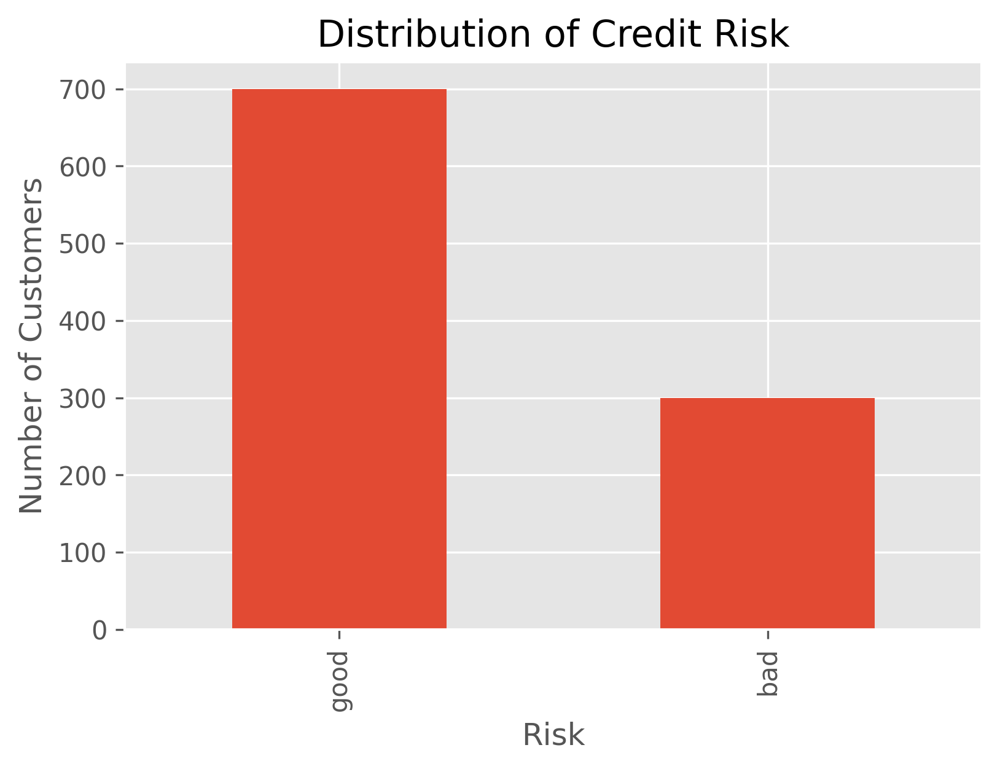
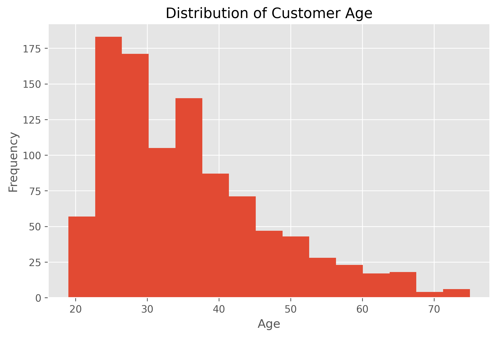
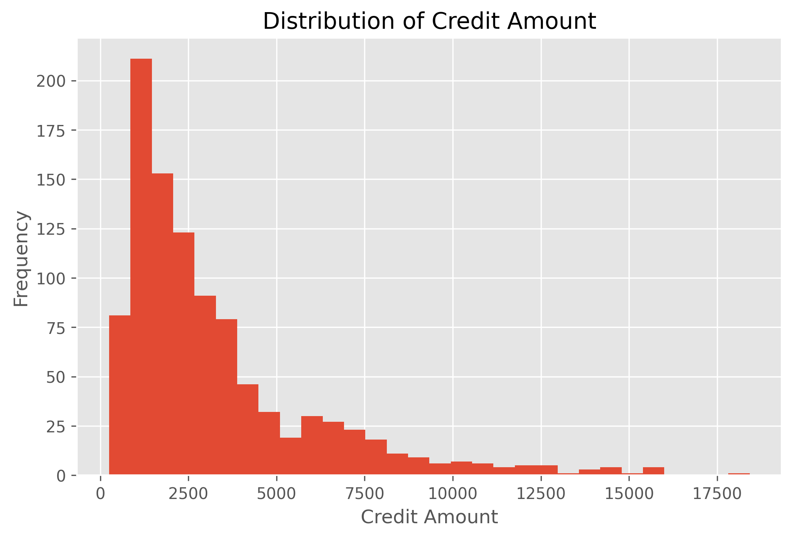
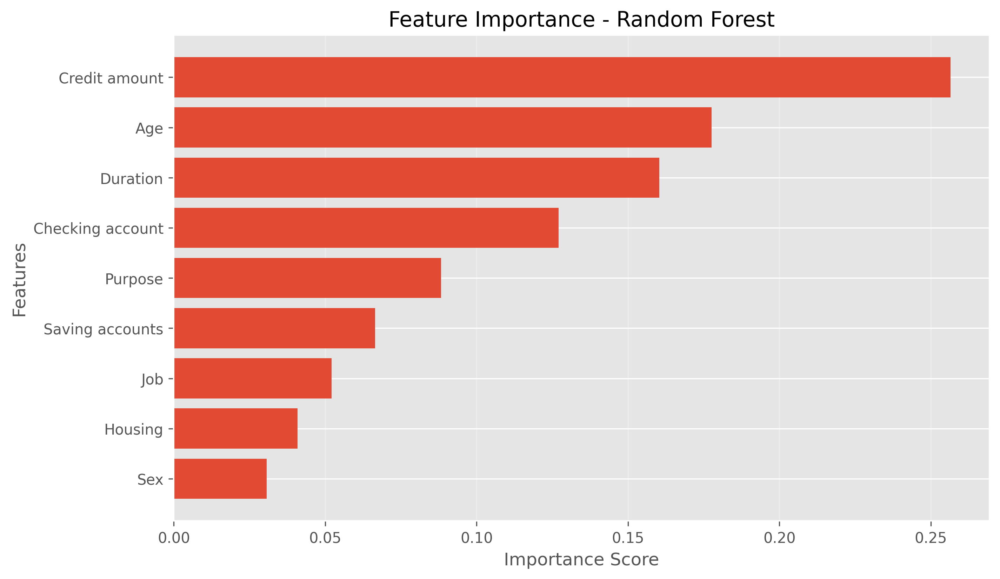

# Credit Risk Prediction Using Machine Learning

## Project Overview

Financial institutions must accurately assess the creditworthiness of loan applicants to minimize defaults and maximize profitability. This project develops a machine learning model that predicts whether a customer represents a **good** or **bad** credit risk using the German Credit dataset.

The project demonstrates the complete machine learning workflow from data exploration to model evaluation and feature importance analysis.

---

## Business Problem

Incorrect lending decisions can lead to financial losses due to loan defaults.

The objective of this project is to build a predictive model that helps financial institutions:

- Identify high-risk applicants
- Reduce credit losses
- Improve loan approval decisions
- Support data-driven credit risk assessment

---

## Dataset

**Dataset:** German Credit Dataset

The dataset contains **1,000 loan applicants** with demographic and financial information.

### Features

- Age
- Sex
- Job
- Housing
- Saving Accounts
- Checking Account
- Credit Amount
- Loan Duration
- Loan Purpose

### Target Variable

- Good Credit Risk
- Bad Credit Risk

---

## Project Workflow

1. Data Collection
2. Data Understanding
3. Exploratory Data Analysis (EDA)
4. Data Cleaning
5. Feature Engineering
6. Data Preprocessing
7. Model Training
8. Model Evaluation
9. Feature Importance Analysis
10. Model Saving

---

## Exploratory Data Analysis

The following analyses were performed:

- Risk Distribution
- Age Distribution
- Credit Amount Distribution
- Loan Duration Distribution
- Gender Distribution
- Housing Status
- Loan Purpose
- Risk by Gender
- Risk by Housing
- Risk by Job
- Risk by Loan Purpose
- Saving Accounts vs Risk
- Checking Accounts vs Risk
- Correlation Analysis
- Outlier Detection

---
## Exploratory Data Analysis

The following analyses were performed:

- Risk Distribution
- Age Distribution
- Credit Amount Distribution
- Loan Duration Distribution
- Gender Distribution
- Housing Status
- Loan Purpose
- Risk by Gender
- Risk by Housing
- Risk by Job
- Risk by Loan Purpose
- Saving Accounts vs Risk
- Checking Accounts vs Risk
- Correlation Analysis
- Outlier Detection

---

## Project Visualizations

### Risk Distribution



### Age Distribution



### Credit Amount Distribution



### Feature Importance



---

## Machine Learning Models

The following classification algorithms were evaluated:

- Logistic Regression
- Decision Tree
- Random Forest

## Machine Learning Models

The following classification algorithms were evaluated:

- Logistic Regression
- Decision Tree
- Random Forest

---

## Model Performance

| Model | Accuracy | ROC-AUC |
|--------|---------:|--------:|
| Logistic Regression | 66.5% | 0.662 |
| Decision Tree | 64.0% | 0.562 |
| **Random Forest** | **74.5%** | **0.747** |

### Best Model

The **Random Forest Classifier** achieved the highest performance.

- Accuracy: **74.5%**
- ROC-AUC: **0.747**

Therefore, Random Forest was selected as the final model.

---

## Feature Importance

The Random Forest model identified the following as the most influential features:

1. Credit Amount
2. Age
3. Loan Duration
4. Checking Account
5. Loan Purpose
6. Saving Accounts
7. Job
8. Housing
9. Sex

---

## Business Insights

Key findings include:

- Customers with larger loan amounts generally present higher credit risk.
- Longer loan durations are associated with increased lending risk.
- Customers with stronger savings and checking account balances tend to have better credit profiles.
- Housing status provides useful information for assessing financial stability.
- Loan purpose influences repayment risk.

---

## Technologies Used

- Python
- Pandas
- NumPy
- Matplotlib
- Scikit-learn
- Google Colab
- GitHub

---

## Project Structure

```
credit-risk-prediction-ml/
│
├── app/
├── data/
│   └── raw/
├── images/
├── models/
├── notebooks/
├── reports/
├── src/
├── README.md
├── requirements.txt
└── .gitignore
```

---

## Future Improvements

Future versions of this project may include:

- Hyperparameter tuning
- XGBoost and LightGBM models
- Model deployment using Streamlit
- SHAP model explainability
- Interactive dashboard using Power BI
- REST API deployment with Flask or FastAPI

---

## Author

**Victor Ojwang**

Aspiring Financial Data Scientist specializing in:

- Credit Risk Analytics
- Machine Learning
- Fraud Detection
- Financial Analytics
- Business Intelligence

---

## License

This project is intended for educational and portfolio purposes.
