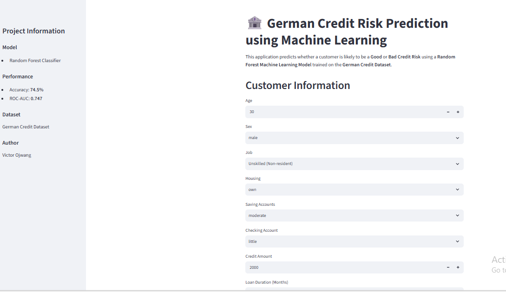

# 🏦 German Credit Risk Prediction using Machine Learning

## 🚀 Live Demo

👉 **Try the application here:**

https://vojwang-credit-risk-prediction.streamlit.app/

---

## 📸 Application Preview



---

## 📖 Project Overview

This project predicts whether a customer is likely to be a **Good Credit Risk** or **Bad Credit Risk** using a **Random Forest Machine Learning model** trained on the German Credit Dataset.

The application is deployed using **Streamlit Community Cloud**, allowing users to make predictions through an interactive web interface.

---

## 🎯 Features

- Data Cleaning and Preprocessing
- Exploratory Data Analysis (EDA)
- Feature Engineering
- Logistic Regression Model
- Decision Tree Model
- Random Forest Model
- Model Evaluation
- Feature Importance Visualization
- Streamlit Web Application
- Cloud Deployment

---

## 📊 Model Performance

| Metric | Value |
|---------|--------|
| Best Model | Random Forest |
| Accuracy | **74.5%** |
| ROC-AUC | **0.747** |

---

## 🛠️ Technologies Used

- Python
- Pandas
- NumPy
- Scikit-learn
- Matplotlib
- Seaborn
- Joblib
- Streamlit
- GitHub

---

## 📂 Project Structure

```text
credit-risk-prediction-ml/
│
├── app/
│   └── app.py
│
├── models/
│   ├── credit_risk_random_forest.pkl
│   └── label_encoders.pkl
│
├── images/
├── data/
├── notebooks/
├── reports/
├── src/
├── README.md
├── requirements.txt
└── .gitignore
```

---

## ▶️ Running Locally

Clone the repository:

```bash
git clone https://github.com/vojwang/credit-risk-prediction-ml.git
```

Install dependencies:

```bash
pip install -r requirements.txt
```

Run the application:

```bash
streamlit run app/app.py
```

---

## 👨‍💻 Author

**Victor Ojwang**

GitHub: https://github.com/vojwang

LinkedIn: https://www.linkedin.com/in/victor-ojwang

---

## ⭐ Support

If you found this project useful, please consider giving it a ⭐ on GitHub.
